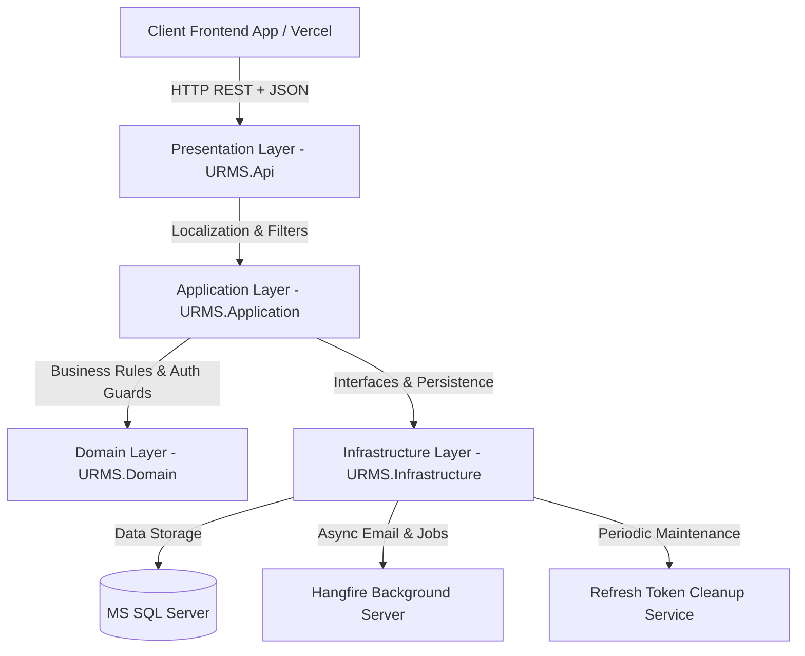

# 🎓 URMS - University Request Management System

[](https://dotnet.microsoft.com/)
[](https://cleanarchitecture.io)
[](https://www.microsoft.com/sql-server)
[](https://urms-lake.vercel.app)
[](https://urms.runasp.net/swagger/index.html)
[](LICENSE)

> An enterprise-grade, multi-lingual RESTful API built with **ASP.NET Core (.NET 8/9)**, **Clean Architecture**, and modern software design patterns to digitize, automate, and orchestrate university student academic petitions, dynamic request workflows, and administrative advisor allocations.

🌐 **Live Web Application**: [https://urms-lake.vercel.app](https://urms-lake.vercel.app)  
📖 **Interactive API Documentation (Swagger)**: [https://urms.runasp.net/swagger/index.html](https://urms.runasp.net/swagger/index.html)

---

## 📌 Overview

The **University Request Management System (URMS)** was built to solve a critical operational challenge in higher education: replacing paper-based, slow academic request processes with an automated, audit-verifiable backend platform.

URMS allows university administrators to dynamically define request form templates with custom validation fields without changing database schemas or redeploying code. It orchestrates complex multi-tier request lifecycles (Student ➔ Academic Advisor ➔ Department Staff ➔ Dean/Admin), tracks full audit histories, enforces strict security boundaries, and delivers localized responses in both **Arabic** and **English**.

---

## ✨ Key Features

- **🏛️ Clean Architecture & Layer Decoupling**: Strict separation of concerns (Domain, Application, Infrastructure, Presentation) ensuring core business rules are independent of frameworks and ORMs.
- **📄 Dynamic Form Engine**: Admins can dynamically configure request forms (`FormDefinition`, `FormFieldDefinition`) with dynamic input types and validation rules at runtime.
- **🔄 Request Lifecycle & Audit Logging**: End-to-end management of student petitions (creation, state transitions, approvals/rejections) paired with immutable audit trails (`RequestHistoryLog`).
- **👨‍🏫 High-Performance Academic Advisor Assignment**: Subsystem for assigning students to academic advisors featuring optimized SQL `IQueryable` pipelines, dynamic search expressions, and batch Excel file imports.
- **🔐 Dynamic Permission-Based Authorization**: Custom `PermissionPolicyProvider` and `PermissionAuthorizationHandler` that evaluate granular user permissions at runtime.
- **🛡️ Dual Security Authentication (JWT + HttpOnly Cookies)**: Flexible auth supporting standard `Authorization: Bearer <token>` headers as well as secure `HttpOnly` cookie session extraction (`URMS.AuthSession`) with Refresh Token rotation.
- **⚡ Asynchronous Hangfire Job Engine**: Offloaded time-consuming background tasks (email dispatches for OTP and request updates) to Hangfire queues to keep HTTP API responses sub-50ms.
- **🌍 Multi-Lingual API Localization**: Built-in request localization supporting Arabic (`ar-EG`, `ar`) and English (`en-US`, `en`) for localized system error codes and status messages.
- **⏱️ Custom Rate Limiting & Protection**: Fixed-window rate limiters protecting sensitive endpoints (Auth capped at 5 req/30s, OTP capped at 3 req/min) to prevent brute-force attacks.

---

## 🏗️ Architecture & Design Patterns

### Architectural Diagram



### Architectural Rationale (The "Why")

| Pattern / Architecture | Technical Rationale & Decision Impact |
| :--- | :--- |
| **Clean Architecture** | Keeps core domain entities (`UniversityRequest`, `FormDefinition`, `Student`) completely agnostic of database, Web API framework, or third-party libraries. Enables 100% unit-testability of business rules. |
| **Generic Repository & Unit of Work** | Abstraction layer over Entity Framework Core that provides a unified database interaction interface and enforces atomic transaction boundaries (`CommitAsync`) across multiple updates. |
| **Dynamic Permission Policy Provider** | Replaces static `[Authorize(Roles="...")]` attributes with runtime dynamic policy evaluation, allowing admins to modify user permissions on the fly without recompiling backend code. |
| **Service Facade Pattern** | Encapsulates granular domain services (`IRequestCreationService`, `IRequestWorkflowService`, `IRequestQueryService`) behind a unified facade (`IUniversityRequestService`) to maintain clean controller interfaces. |
| **Options Pattern** | Binds configuration settings (`JwtSettings`, `EmailSettings`) from `appsettings.json` to strongly-typed C# classes, providing compile-time safety and dependency injection capability. |

---

## 🛠️ Tech Stack & Packages

| Category | Technology / Package | Purpose & Integration |
| :--- | :--- | :--- |
| **Framework** | ASP.NET Core (.NET 8 / 9) | High-performance, cross-platform Web API foundation |
| **Database & ORM** | MS SQL Server & EF Core | Relational persistence, code-first migrations, and optimized LINQ queries |
| **Mapping** | Mapster | High-performance object-to-object mapping between Entities and DTOs |
| **Validation** | FluentValidation | Strongly-typed request validation rules executed before business logic |
| **Auth & Security** | ASP.NET Core Identity & JWT | Identity management, role-based claims, JWT Bearer & Cookie Auth |
| **Background Processing**| Hangfire (`Hangfire.SqlServer`) | Persistent background job server for async email notifications and retries |
| **Localization** | Microsoft.AspNetCore.Localization | Native multi-lingual localization for Arabic and English request headers |
| **Logging** | Serilog | Enriched JSON structured logging for request tracing and error diagnostics |
| **Testing** | xUnit, Moq, FluentAssertions | Unit testing application services, validation rules, and domain models |

---

## 🔒 Security & Best Practices

- **Dual-Token Authentication (JWT + Refresh Tokens)**: Access tokens paired with HttpOnly Refresh Tokens rotated on every authorization cycle.
- **Anti-IDOR (Insecure Direct Object Reference) Mitigation**: Requests explicitly verify student/advisor identity against current `UserId` claims to prevent unauthorized cross-user data tampering.
- **Dynamic Permission Authorization**: Custom authorization handlers evaluate user permission claims per API action.
- **Rate Limiting Guardrails**: Rate limiters safeguard Auth endpoints (5 attempts per 30 seconds) and OTP endpoints (3 attempts per minute).
- **RFC 7807 Problem Details Error Handling**: Global exception middleware intercepts all unhandled errors and maps them to standard, localized `ProblemDetails` responses without disclosing stack traces.

---

## ⚡ Performance Optimization

- **Database-Level Query Execution (`IQueryable`)**: Advisor assignment filters and dynamic student searches execute directly on MS SQL Server via LINQ expressions, preventing memory-bound `IEnumerable` loading.
- **Trackless Entity Queries (`AsNoTracking`)**: Read-only queries disable EF Core tracking to minimize memory consumption during high-concurrency requests.
- **Asynchronous Non-Blocking Execution**: `async/await` throughout database queries, identity management, and external service calls prevents thread pool exhaustion.
- **Offloaded Email Deliveries**: Email and OTP delivery operations are offloaded to Hangfire background queues, keeping API request processing times under 50ms.
- **Automated Background Cleanup**: Background `RefreshTokenCleanupService` runs periodically to clear expired database tokens.

---

## 📂 Project Structure

```text
d:\Asp.Net\Asp.Net_Api\University Request Management System\
├── URMS.Api/                     # Presentation Layer (Controllers, Middleware, Swagger, RateLimiter, DI)
├── URMS.Application/             # Business Logic Layer (Services, DTOs, Validators, Mapster, Contracts)
├── URMS.Domain/                  # Core Domain Layer (Entities, Enums, Contracts, Constants)
└── URMS.Infrastructure/           # Infrastructure Layer (AppDbContext, Migrations, Repositories, Identity, Hangfire)
```

---

## 🚀 Getting Started

### Prerequisites

- [.NET 8.0 / 9.0 SDK](https://dotnet.microsoft.com/download)
- [MS SQL Server](https://www.microsoft.com/sql-server)

### Installation & Setup

1. **Clone the Repository**:
   ```bash
   git clone https://github.com/MahmoudHussien74/University-Request-Management-System.git
   cd "University Request Management System"
   ```

2. **Configure Database Connection & App Settings**:
   Update `URMS.Api/appsettings.json` (or `appsettings.Development.json`) with your SQL Server connection string and JWT key:
   ```json
   {
     "ConnectionStrings": {
       "DefaultConnection": "Server=localhost;Database=URMS_Db;Trusted_Connection=True;TrustServerCertificate=True;"
     },
     "JwtSettings": {
       "Key": "YOUR_SUPER_SECRET_SECURITY_KEY_AT_LEAST_32_CHARS",
       "Issuer": "URMS.Api",
       "Audience": "URMS.Client",
       "DurationInMinutes": 60
     }
   }
   ```

3. **Apply Database Migrations**:
   ```bash
   dotnet ef database update --project URMS.Infrastructure --startup-project URMS.Api
   ```

4. **Run the API**:
   ```bash
   dotnet run --project URMS.Api
   ```

---

## 📖 API Documentation

Access live interactive Swagger UI at:  
👉 **[https://urms.runasp.net/swagger/index.html](https://urms.runasp.net/swagger/index.html)**

### Key Endpoint Highlights

| Method | Endpoint | Description | Authorization |
| :--- | :--- | :--- | :--- |
| `POST` | `/api/v1/auth/login` | Authenticate user & issue JWT + Refresh Token | ❌ Public |
| `POST` | `/api/v1/auth/refresh-token` | Exchange Refresh Token for a new Access Token | ❌ Public |
| `GET` | `/api/v1/forms` | Get dynamic forms available for student submission | 🔐 Authenticated |
| `POST` | `/api/v1/admin/forms` | Create dynamic request form definitions & fields | 🔐 Admin |
| `POST` | `/api/v1/requests` | Submit an academic request petition | 🔐 Student |
| `GET` | `/api/v1/requests` | List user requests with localized status | 🔐 Authenticated |
| `POST` | `/api/v1/advisor-assignments` | Assign academic advisors to students (Single/Batch) | 🔐 Admin / Staff |

---

## 🧪 Testing

The repository contains automated unit tests covering application services, request validation, and domain logic.

Execute tests using .NET CLI:
```bash
dotnet test
```

For verbose output:
```bash
dotnet test --logger "console;verbosity=detailed"
```

---

## 📸 Screenshots & Live Demo

- 🌐 **Live Web Application (Vercel)**: [https://urms-lake.vercel.app](https://urms-lake.vercel.app)
- 📖 **Live Swagger UI**: [https://urms.runasp.net/swagger/index.html](https://urms.runasp.net/swagger/index.html)

| Interactive Swagger Documentation | Hangfire Job Monitoring Dashboard |
| :---: | :---: |
|  |  |


## 🤝 Contact & Developer Profile

**Mahmoud Hussien**

- **Email**: [mahmoudhussien.m74@gmail.com](mailto:mahmoudhussien.m74@gmail.com)
- **GitHub Repository**: [MahmoudHussien74/University-Request-Management-System](https://github.com/MahmoudHussien74/University-Request-Management-System)
- **Live Demo**: [https://urms-lake.vercel.app](https://urms-lake.vercel.app)


